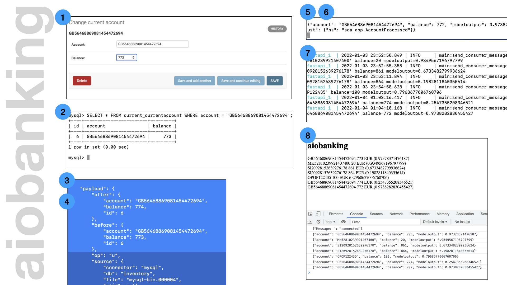

# aiobanking

Architecture PoC showing event sourcing for banking use cases.

The setup solves typical issues of scalability,
especially by demonstrating three types of
asynchronous computing / the reactive pattern:

1. Usage of concurrency achieved by asynchronous
   computing in the backends' code (fastapi & faust both `asyncio`).
2. Decoupling of components through asynchronous communication (kafka & websocket).
3. The whole enterprise follows a CQRS pattern
   where the millions of customers are never directly causing
   load on any of the backend systems.

As a side effect the whole organization is now
operating in real-time.




# Run this PoC

```
# Start
./docker-compose up -d

# Populate the database
./populate-db.sh

# Deploy the MySQL connector
curl -i -X POST -H "Accept:application/json" -H  "Content-Type:application/json" http://localhost:8083/connectors/ -d @sor/cdc-mysql.json

# Start the JS/websockets page
cd soe
python -m SimpleHTTPServer 1234

# For the first time: deploy the React UI to the docker-running react app
docker-compose  up -d --build aiobankingui

# Run the docker container with the React UI
docker-compose  up -d aiobankingui

# Open the React UI running in the docker container
http://127.0.0.1:3001/
```

## System of Record (SoR)

Visit http://127.0.0.1:8000/admin/current/currentaccount/ with
your browser (user `root`, password `root`). It's key you create
changes to the existing accounts.

## System of Engagement (SoE)

Visit http://127.0.0.1:1234 and watch processed account changes
coming in.

## Inspect System of Integration (SoI) and System of Analytics (SoA)

```
# Log in into the database
docker run -it --rm --network aiobanking_default --name mysqlterm --link aiobanking_mysql_1 --rm mysql:8.0 sh -c 'exec mysql -h"$MYSQL_PORT_3306_TCP_ADDR" -P"$MYSQL_PORT_3306_TCP_PORT" -uroot -p"$MYSQL_ENV_MYSQL_ROOT_PASSWORD" --host=mysql'

# log in to Kafka
docker exec -i -t -u root $(docker ps | grep kafka | cut -d' ' -f1) /bin/bash

# list topics
./bin/kafka-topics.sh --list --bootstrap-server kafka:9092

# observe changes
$KAFKA_HOME/bin/kafka-console-consumer.sh --bootstrap-server kafka:9092 --topic current_currentaccount --from-beginning

# Watch faust reacting to changes in the database coming in
docker-compose logs faust
```

# Initial setup / Dev hints

```
# create django layout
docker-compose run django django-admin startproject systemofrecord
sudo chown -R $USER sor

# Data & migrations:
docker-compose run sor python manage.py createsuperuser
docker-compose run sor python manage.py migrate
docker-compose run sor python manage.py makemigrations

# Rebuild Image:
docker-compose build django

# Running containers + IDs nicely formatted
docker ps --format '{{.ID}}\t{{.Names}}'
```

# Acknowledgment

The setup of mysql, kafka and debezium was taken from the [debezium tutorial](https://debezium.io/documentation/reference/1.8/tutorial.html). This was then connected to faust as explained by [David Farrugia](https://towardsdatascience.com/introduction-to-kafka-stream-processing-in-python-e30d34bf3a12). The blog post by
[Benjamin Ramser](https://iwpnd.pw/articles/2020-03/apache-kafka-fastapi-geostream) helped me to set up a frontend listening to websockets fed by a stream.
